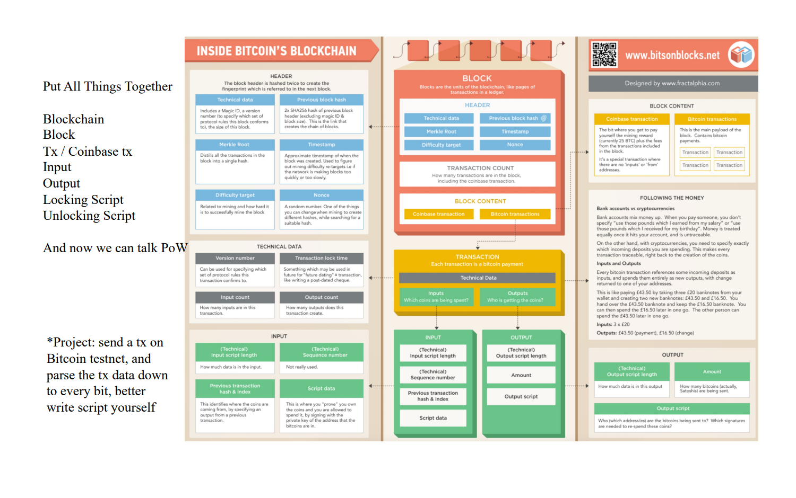

Parse the tx data
=====

小组信息
----
戈智昂 网安20级4班 202000460145

prj comes from
----

tx来源：
-----

https://sochain.com/api/v2/tx/BTC/9ea0df029f138e92f50379df6fde0ade9cf101cb8c975825c74188305cac6eed

翻到页底，找到最后的“tx_hex”

即为本实验使用的tx文本
