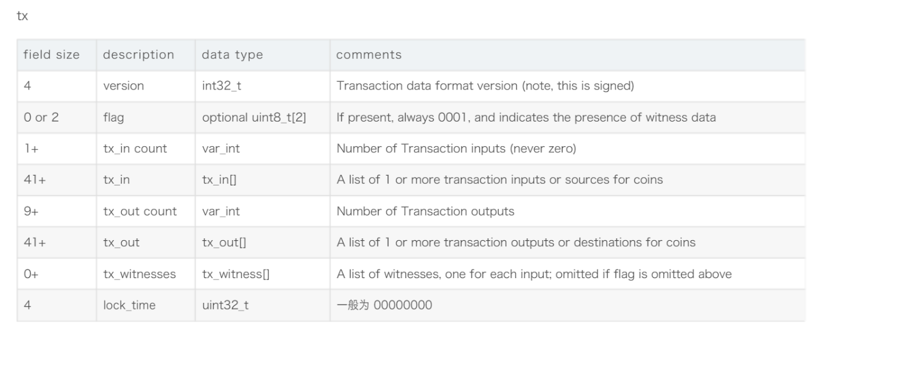

Parse the tx data
=====
手动拆分，将tx文本最前面包含两段txin和两端txout截取进行了拆分

小组信息
----
戈智昂 网安20级4班 202000460145

格式参考
----

prj comes from
----

tx来源：
-----

https://sochain.com/api/v2/tx/BTC/9ea0df029f138e92f50379df6fde0ade9cf101cb8c975825c74188305cac6eed

翻到页底，找到最后的“tx_hex”

本实验使用的tx文本
----
0100000000010264066fbd45afd2cedaf3638a9886f80c863e6fe083c797ac0c64c93998a7b10ffd03000023220020bdd68a4cff85348e9300087f455fbad025c1e7fb54bdbf17a8c044876309069dffffffff9cf4f90ec1d0c0eae485724c4dce55e4278a1f78016d224531552c20bb94f74c0000000023220020bdd68a4cff85348e9300087f455fbad025c1e7fb54bdbf17a8c044876309069dfffffffffd4f0544620000000000001976a9140000b282a95bf9feff2e0b219cbc1f4d30ecee0c88ac51760000000000001976a91400a5a578278245ac83ff7d6e1753babe2d22617488ac837

拆分过程
----

Version：01000000

Flag: 0001

Input:02  

Txin1：

64066fbd45afd2cedaf3638a9886f80c863e6fe083c797ac0c64c93998a7b10ffd03000023220020bdd68a4cff85348e9300087f455fbad025c1e7fb54bdbf17a8c044876309069dffffffff

{
Output point: 64066fbd45afd2cedaf3638a9886f80c863e
Script: e083c797ac0c64c93998a7b10ffd03000023220020bdd68a4cff85348e9300087f455fbad025c1e7fb54bdbf17a8c044876309069d
Sequence: ffffffff
}

Txin2：
9cf4f90ec1d0c0eae485724c4dce55e4278a1f78016d224531552c20bb94f74c0000000023220020bdd68a4cff85348e9300087f455fbad025c1e7fb54bdbf17a8c044876309069dfffffffff

Output1：44620000000000001976a9140000b282a95bf9feff2e0b219cbc1f4d30ecee0c88ac5176

{
Transaction value: 4462000000000000
pk_scipt len:19
pk_script: 76a9140000b282a95bf9feff2e0b219cbc1f4d30ecee0c88ac
}

output2：51760000000000001976a91400a5a578278245ac83ff7d6e1753babe2d22617488ac837

