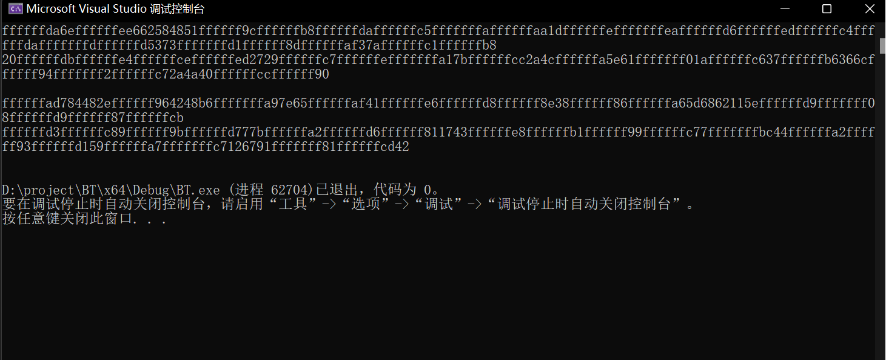

birthday attack（for sm3）
======
小组信息
----
戈智昂 网安20级4班 202000460145

来源
----

实验说明
----
prj主体只有bt.cpp&sm3.h

实验思路为：

首先用一个string x[N]来存原像（N为迭代次数）

原像的每个byte在每次迭代时通过随机数生成器rand生成，范围为0~255,也就是一个8bit unsigned输的取值范围

然后原像arr[i]经过hash——>sm3(arr[i])    //这里做了reduce，每次只取sm3的32bit，也就是IV[0],作为像

我们将这个值存在IVset数组中

经过k次迭代IVset中理应有前k次生成的像

而原像则都储存在x中

每生成一次像都和之前的像进行比对

像相同且原像不同时输出一对原像（以十六进制输出）

运行截图
----

