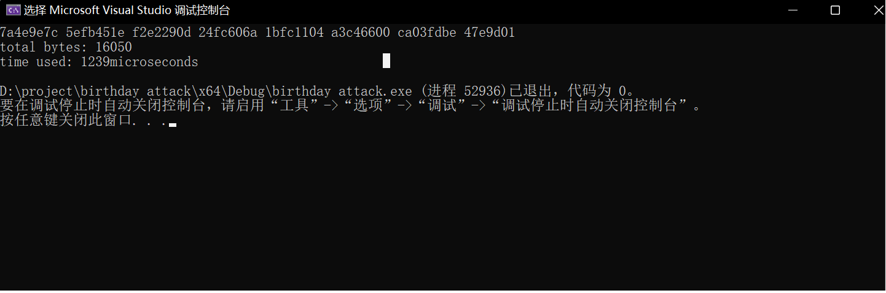

SM3
====
此项目为对sm3的复现及优化

代码编写全程参考：

中华人民共和国密码标准SM3密码杂凑算法文档GM/T 0004 2012

小组信息
----
戈智昂 网安20级4班 202000460145

优化方法说明
----
在网上找到c++代码(写的很冗余)
https://blog.csdn.net/nicai_hualuo/article/details/121555000

发现使用的是string作为主要数据结构，并且在过程中进行了数不胜数的进制转换，为优化重新编写代码：

将数据部分用32位无符号整数代替

对于位运算，由于数据位只有32位，可以放心进行移位即达成32位移位，&和^操作也可以对两个整数操作进行而无需循环

尝试进行循环展开，能展开的地方不多，收效不大

整个算法能并行的地方几乎没有，不管是顶层的迭代过程，还是最里层函数的扩展（W）还是压缩（A-H）都有着极强的依赖关系，无法进行thread分线程

函数与文档对应关系
----
初始值IV 
常量Tj通过同名函数实现

布尔函数FF GG通过同名函数实现

置换函数P0 P1 通过同名函数实现

算法的填充部分
在sm3()的主体部分实现（将成块的部分先压缩），再填充剩余部分
同样迭代过程就是sm3()的循环

消息扩展目的是将分组扩展成132个消息字，分别由W0与W1两个数组表示
对应函数为extend

压缩函数为最主要函数对应compress

cout输出256bit的杂凑值(hex)

正确性检验
----
对于sm3标准文档中的'abc'：
结果为66c7f0f4 62eeedd9 d1f2d46b dc10e4e2 4167c487 5cf2f7a2 297da02b 8f4ba8e0
符合结果

时间测试
----
这里使用了chrono方法，因为当数据很多时，用clock()测试仍在0~1ms浮动，难以反映时间

故采用微妙计数

对于16050byte的数据

需要1000——1300微秒

